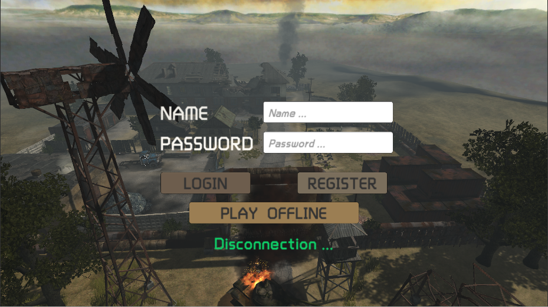
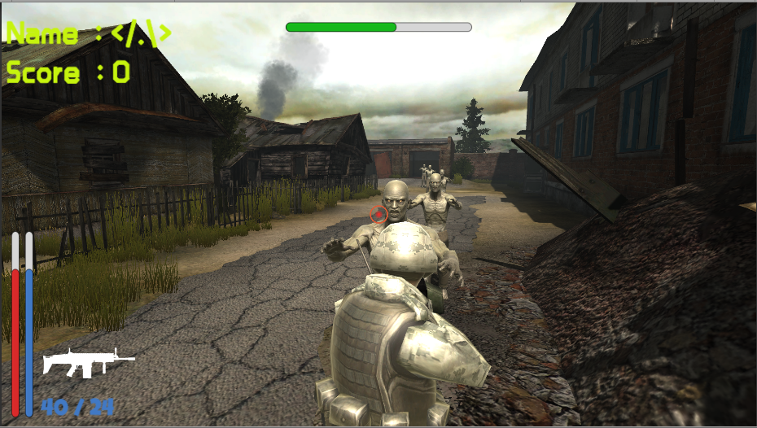

Unity 3D 里运行 Assets/Scene/GameScene.unity  

Client     （请把屏幕分辨率调至1920*1080运行）
1. 鼠标中键切换 点射 和 连射
2. R键换弹夹
3. Shift键加速
4. WADS键分别控制角色的前、左、右、后位移，空格键跳跃
4. 僵尸从车房生成，击杀后掉落弹药补给，补给10秒后消失
5. Esc键退出游戏

Server   （以下数据均代表游戏数据，包括血量，得分，子弹量）
1. 可以创建账号，通过账号保存游戏数据
2. 同时处理多个账号的数据
3. 实现多人联机
4. 控制客户端怪物生成

登录界面

游戏画面

.........................................框架.........................................
Client      （客户端代码均在Scripts里）

1.Enemy
     1). ZombieController.cs   怪物控制脚本
     2). ZombieData.cs  怪物数据脚本

2.Manager
     1). Ammo.cs  补给箱的控制脚本
     2). EnemyManager.cs  离线游玩时，敌人生成控制脚本
     3). GameManager.cs  游戏控制脚本，接收服务器数据及处理数据均在此实现
     4). Message.cs  游戏数据格式定义，进行服务器数据包分类，客户端数据数据流转换
     5). NetWork.cs  游戏联网基础模块，负责接收服务器数据，以及解析数据，负责客户端数据流打包，并发送至服务器

3.Player
     1). PlayerController.cs  玩家角色控制脚本
     2). PlayerData.cs  玩家数据脚本
     3). PlayerPrefab.cs  客户端其他玩家模型控制脚本
     4). TPSCamera.cs  游戏第三人称相机控制脚本

4.Setting
     1). GameSetting.cs  游戏全局变量定义
     2). NetSetting.cs  游戏网络数据包代码定义

5.UI
     1). GameUI.cs  游戏界面脚本
     2). JumpText.cs  伤害跳字脚本
     3). LoginUI.cs  登录界面脚本
     4). ZombieUI.cs  怪物的跳字脚本

Server

1.common
      1). conf.py  服务器全局变量，包括模块编码，函数编码，消息类型编码，以及服务器常量
      2). event.py  消息格式定义
      3). header.py  数据包定义

2.common_server
      1). timer.py  服务器定时器实现

3.Entity
      1). entity.py  服务器游戏对象基类
      2). playerEntity.py  服务器玩家对象，负责临时存放玩家数据
      3). zombieEntity.py  服务器怪物对象，负责临时存放怪物数据

4.Module
      1). dispatcher.py  服务器模块基类
      2). dataBaseModule.py  服务器数据库处理模块
      3). loginModule.py  服务器用户登录处理模块
      4). playerEntityModule.py  服务器玩家处理模块
      5). zombieEntityModule.py  服务器怪物处理模块

5.Network
      1). netStream.py  客户端套接字操作封装
      2). simpleHost.py  服务器套接字操作封装

6.Setting
      1). KeyType.py  服务器  字典键定义

7.Server.py  定义服务器类，负责接收数据处理后，按照编码发送到各个模块处理，负责消息队列里数据发送
      

